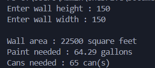

# Lab 02 – Painting a Wall

This is a simple Java program completed as part of my coursework at Arizona State University.  
The program calculates the **amount of paint needed** to cover a wall, given its height and width in feet.

---

## 📝 Problem Description
The program:
1. Prompts the user to enter the **wall height** and **wall width** (in feet).
2. Calculates the **wall area** in square feet.
3. Determines how many **gallons of paint** are required (1 gallon covers 350 sq. ft.).
4. Rounds up to the nearest whole number to determine the number of **paint cans needed**.

## 🚀 How to Run
1. Compile the program:
   ```bash
   javac Paint.java

